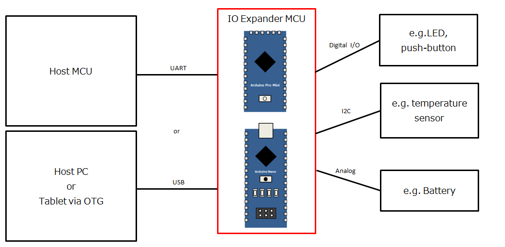
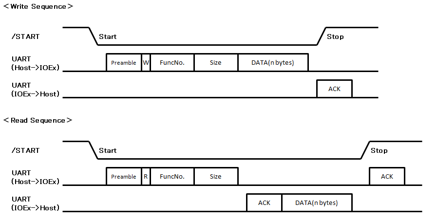
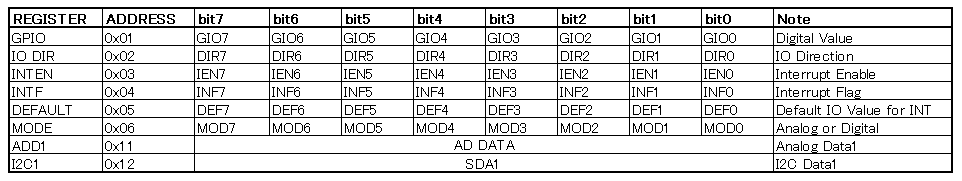

# arduino-ioexpander-fw
IO Expander Device Arduino Firmware with UART

## Overview

  

## Requirement

- Arduino Nano or Arduino Pro Mini
- Arduino IDE (Version: 1.8.5)

## Usage 
 - Use arduino-ioexpander-lib (Arduino Library. see [arduino-ioexpander-lib](https://github.com/bigw00d/arduino-ioexpander-lib))

## Description

###  Pin connections

|Host MCU  |IO expander Device  |Note  |
|---|---|---|
|Digital In  | /INT |IO Ex -> Host|
|TX  | RX ||
|RX  | TX ||
|Digital Out  | /START |Host -> IO Ex|
|GND  |GND  ||

### Sequences 
  

 * DATA is 8bit  
 * First DATA is Register Address  
 * ADR1:0x1D(7bit), 　ADR2:0x1E(7bit),　W=0b0,　R=0b1  
 * ACK:0x06,　NACK:0x15  

### Register Maps 
  

 * Reading Register: Write sequence(Register Address) -> Read Sequence  
