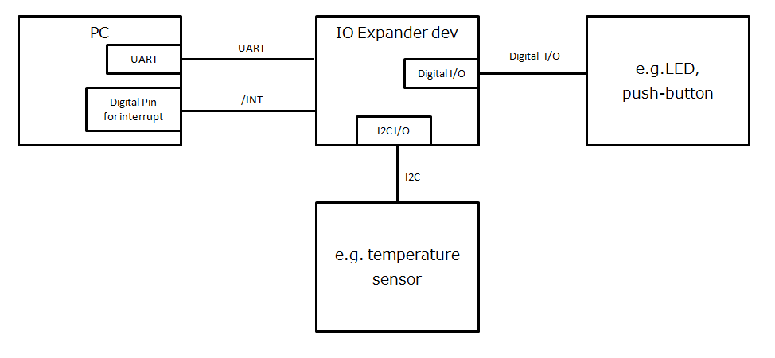

# arduino-ioexpander-fw
IO Expander Device Arduino Firmware with uart

## Example

  

## Requirement

- Arduino Nano or Arduino Pro Mini
- Arduino IDE (Version: 1.8.5)

##  Pin connections

|User Device  |IO expander device  |Note  |
|---|---|---|
|3V3 |3V3  ||
|GND  |GND  ||
|GPIO  | /INT ||
|TX  | RX ||
|RX  | TX ||

## Usage 
 - Use arduino-ioexpander-lib (Arduino Library. see [arduino-ioexpander-lib](https://github.com/bigw00d/arduino-ioexpander-lib))
