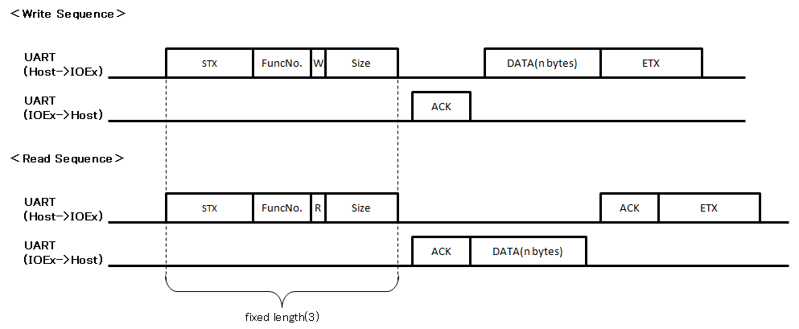

# arduino-ioexpander-fw
IO Expander Device Arduino Firmware with UART

## Overview

  

## Requirement

- Arduino Nano or Arduino Pro Mini
- Arduino IDE (Version: 1.8.5)

## Usage 
 - Use arduino-ioexpander-lib (Arduino Library. see [arduino-ioexpander-lib](https://github.com/bigw00d/arduino-ioexpander-lib))

## Description

###  Pin connections

|Host MCU  |IO expander Device  |Note  |
|---|---|---|
|Digital In  | /INT |IO Ex -> Host|
|TX  | RX ||
|RX  | TX ||
|Digital Out  | /START |Host -> IO Ex|
|GND  |GND  ||

### Sequences 
  

 * Func No. is 7bit
 * W = 0b0, R = 0b1  
 * 'Size' is 8bit 
 * DLE : 0x10, STX : 0x20, ETX : 0x30, ACK : 0x06, NACK : 0x15  

### Function Maps 
  

 * Reading I2C Data: Write sequence(Write Slave Address, Read Length) -> Read Sequence 
 * IO_DIR : OUT = 0b1, IN = 0b0 

## Port Assignment

  

 * Supports interrupts on Digital0 only.
